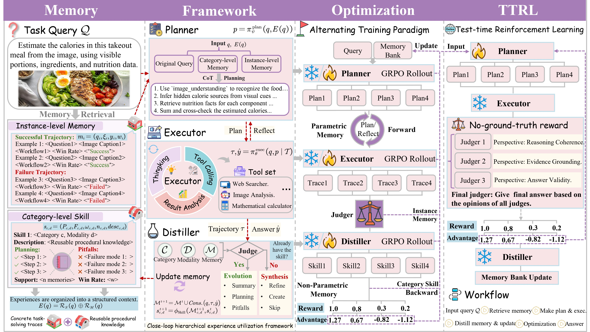

<h1 align="center">
  APEx: Distillation of Agent Procedural Experience for Adaptive Deep Research Question Answering
</h1>

## Overview

<p align="center">
  
</p>

**APEx** (Adaptive Procedural Experience Learning) is a hierarchical experience utilization framework for deep research agents. It organizes interaction history into **instance-level trajectory memories** and **category-level procedural skills**, and couples them through a closed-loop architecture of **Executor**, **Distiller**, and **Planner**.

The three modules are optimized via a **three-stage alternating GRPO training** paradigm, enabling reward-guided skill distillation rather than fixed-prompt generation. At test time, distilled skills serve as procedural priors for online Planner adaptation through **Skill-guided Test-Time Reinforcement Learning (TTRL)**.

### Key Features

- **Hierarchical Experience Memory**: Instance-level memories preserve concrete task-solving traces; category-level skills summarize reusable procedural knowledge.
- **Experience-to-Action Agent Loop**: Executor, Distiller, and Planner form a closed loop where trajectories are collected, abstracted into skills, and reused for strategic planning.
- **Skill-guided Test-time Adaptation**: Distilled skills serve as procedural priors for TTRL, allowing ground-truth-free self-improvement with skill-alignment regularization.

## Tools

### 1. Online Text Search

A FastAPI-based web search service using Serper API, located in `web_tools/`.

```bash
# Configure Serper API key in web_tools/run.sh
export SERPER_KEY_ID="your_serper_api_key"

cd web_tools
bash ./run.sh
```

The service runs at `http://localhost:8002/server/search` by default.

### 2. Offline Text Search

We use [Search-R1](https://github.com/PeterGriffinJin/Search-R1) as the offline retrieval backend, with the [wiki25](https://huggingface.co/datasets/XLDDD/wiki25) corpus and a FAISS index for dense retrieval. Please follow the Search-R1 installation guide to set up the retrieval server:

```bash
# Inside the Search-R1 directory
python search_r1/search/retrieval_server.py \
    --index_path /path/to/faiss_index/e5_Flat.index \
    --corpus_path /path/to/wiki25.jsonl \
    --topk 3 \
    --retriever_name e5 \
    --retriever_model /path/to/e5-base-v2
```

The service runs at `http://localhost:8001/retrieve` by default.

### 3. Image-to-Image Search

Image search uses pre-cached results rather than a live service. The cache files are provided by [LightningCreeper/MIA](https://huggingface.co/datasets/LightningCreeper/MIA/tree/main/image_search_cache).
## Environment

```bash
conda create -n verl python==3.10.12
```

Run the `install.sh` script in any `Train` directory to install dependencies. Flash-attention must be installed separately:

```bash
wget -nv https://github.com/Dao-AILab/flash-attention/releases/download/v2.8.3/flash_attn-2.8.3+cu12torch2.7cxx11abiFALSE-cp310-cp310-linux_x86_64.whl
pip install --no-cache-dir flash_attn-2.8.3+cu12torch2.7cxx11abiFALSE-cp310-cp310-linux_x86_64.whl
```

## Data Preparation

Datasets are hosted at [LightningCreeper/MIA](https://huggingface.co/datasets/LightningCreeper/MIA) on Hugging Face:

- **`Train/`** — Training data for Executor, Distiller, and Planner.
- **`Test/`** — Text-only (2WikiMultihopQA, BrowseComp, GAIA, HotpotQA, SimpleQA) and image-text (InfoSeek, LiveVQA, MMSearch, SimpleVQA, etc.) benchmarks
- **`TTRL/`** — Test split for online Planner adaptation via TTRL

## Three-Stage Alternating RL Training

APEx adopts a three-stage alternating GRPO training paradigm. In each stage, only one module is updated while the other two are frozen.

### Stage 1: Executor Training

The Executor (`Qwen2.5-VL-7B`) is trained for multi-turn tool interaction under a given plan. Configure paths and service URLs in `Executor-Train/Train/local_search/run_mmsearch_grpo.sh` and the config files under `Executor-Train/Train/local_search/configs/`, then run:

```bash
cd Executor-Train/Train/
bash ./local_search/run_mmsearch_grpo.sh
```

### Stage 2: Distiller Training

The Distiller (`Qwen3-8B`) transforms instance-level memories into reusable category-level skill documents.

```bash
cd Writer-Train/Train/

# 1. Build training data from collected Executor trajectories
bash build_writer_data.sh

# 2. Launch Distiller GRPO training (auto-deploys Judger)
bash run_writer_train.sh

# 3. Generate skill repository using the trained Distiller
bash run_generate_skill_repo.sh
```

### Stage 3: Planner Training

The Planner (`Qwen3-8B`) is trained through a plan-execute-evaluate-replan loop. Configure paths in `Planner-Train/mem-plan/local_search/run_mmsearch_grpo.sh`, then run:

```bash
cd Planner-Train/mem-plan/
bash ./local_search/run_mmsearch_grpo.sh
```

The script automatically deploys all dependent services (Judger, Executor, Search, Agent Serve) before starting training.

## Inference

APEx inference runs the full pipeline: Experience Retrieval (Skill + Memory) → Planner → Executor → Experience Update. The script is self-contained and auto-deploys all required services (Judger, Executor, Planner, Search, Memory).

```bash
cd Inference/APEx-noTTRL/ && bash run_inference.sh
```

## Skill-guided TTRL

At test time, APEx further adapts the Planner on unlabeled queries via Skill-guided TTRL, using GRPO with multi-judge no-ground-truth reward and skill-alignment regularization. The script is self-contained and auto-deploys all dependent services (Judge, Executor, Writer, Search, Agent Serve).

```bash
cd TTRL/TTRL-nogt/ && bash run_ttrl_nogt_fvqa_skill.sh
```
